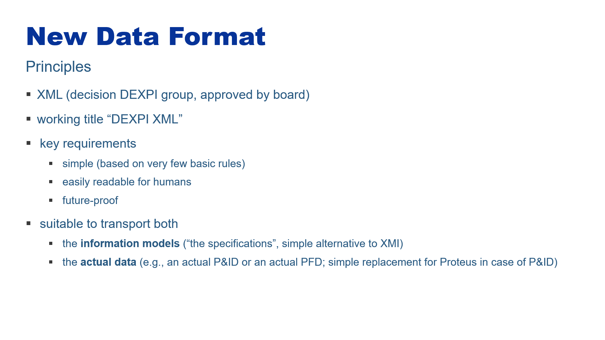
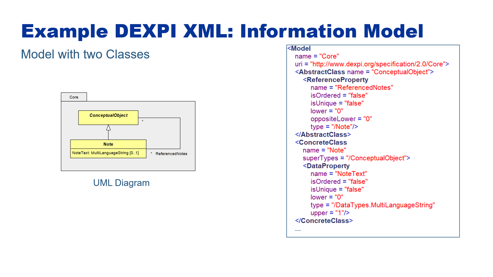
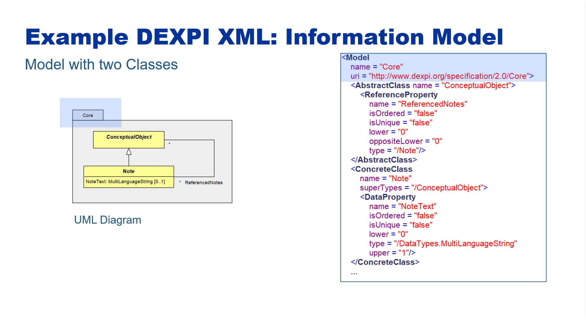
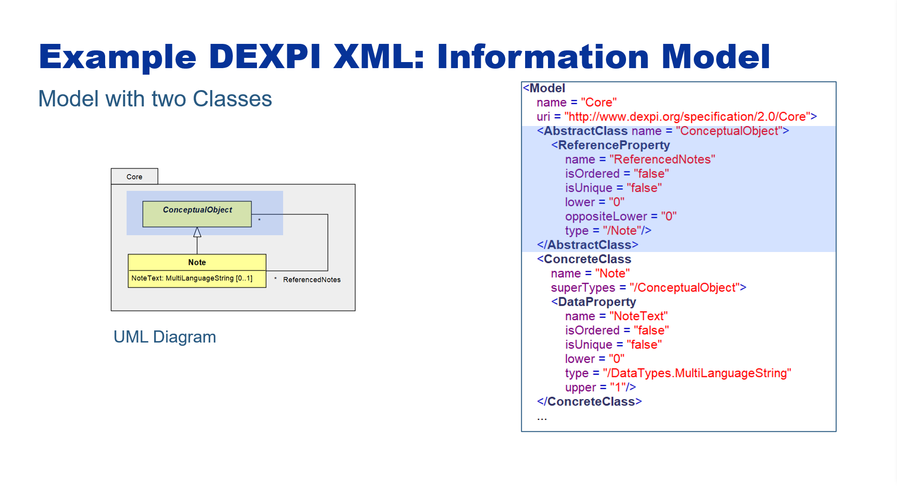
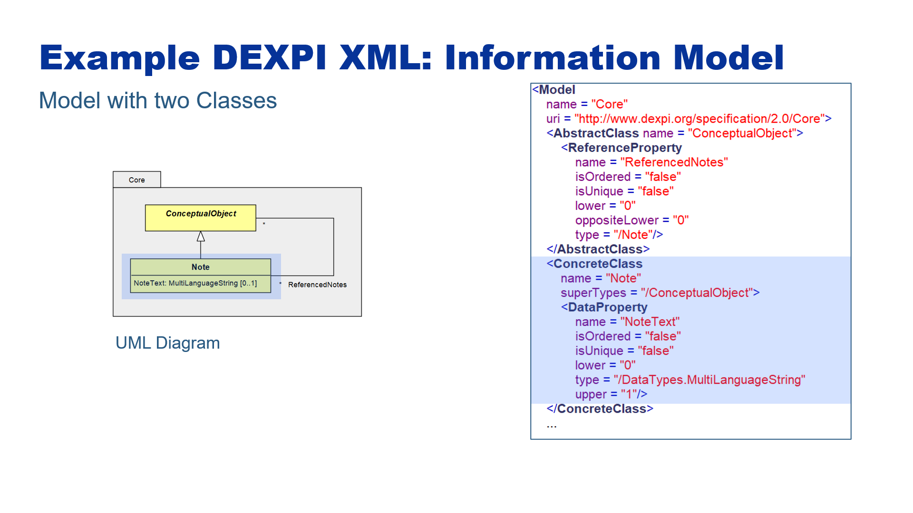
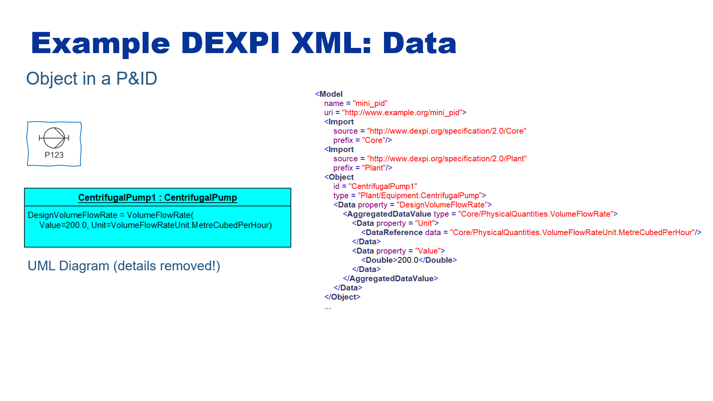
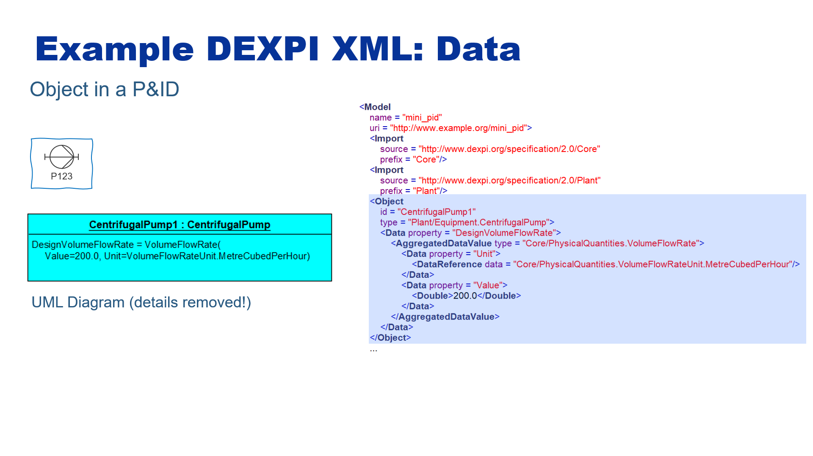
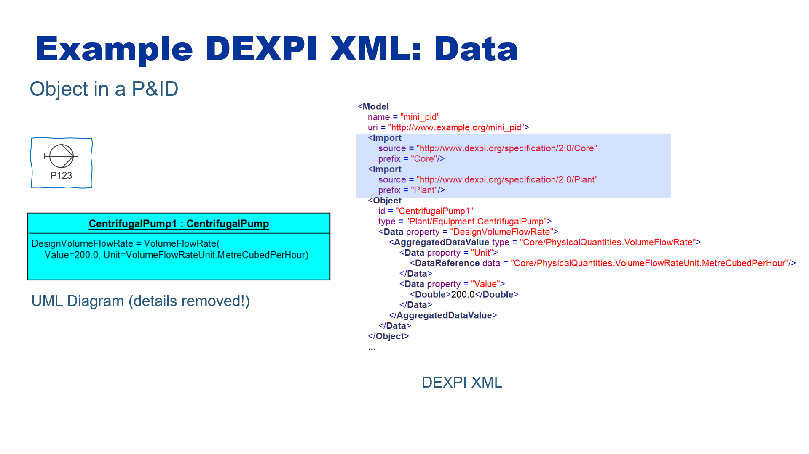

=========
DEXPI XML
=========

Overview
========

DEXPI XML Schema
================

`Download DEXPI_XML_Schema_RC_1.xsd <../_static/DEXPI_XML_Schema.xsd>`_.

There is also a `generated XML Schema documentation <../_static/DEXPI_XML_Schema_doc/index.html>`_.

Several DEXPI XML files are provided. See

- :sp:element:`Model Builtin <Builtin>`,

- :sp:element:`Model Core <Core>`,

- :sp:element:`Model Plant <Plant>`,

- :sp:element:`Model Process <Process>`,

- :ref:`DEXPI Reference P&ID <reference-pid>`.

The root element of a DEXPI XML file has the name :code:`Model`. Its complex type is :code:`Model`.

Simple Types
------------

ID
~~

An :code:`ID` is an :code:`xsd:string` with the same restrictions as a :code:`name`. In addition, an :code:`ID` must be unique in a DEXPI XML file.

IDREF
~~~~~

An :code:`IDREF` is a reference to an :code:`ID` in the same file. It starts with a number sign ("hash", :code:`#`) that is immediately followed by the referenced :code:`ID`.

name
~~~~

A :code:`name` is an :code:`xsd:string` that

- starts with an underscore (:code:`_`) or an upper (:code:`A-Z`) or lower case (:code:`a-z`) letter (ASCII only).

- The start character may be followed by an arbitrary number of underscores, upper or lower case letters, or digits (:code:`0-9`) in an arbitrary order.

nameOrIdReference
~~~~~~~~~~~~~~~~~

A :code:`nameOrIdReference` is either a :code:`nameReference` or an :code:`IDREF`.

nameOrIdReferences
~~~~~~~~~~~~~~~~~~

A :code:`nameOrIdReferences` contains one or more :code:`nameOrIdReference` parts, separated by a space character.

nameReference
~~~~~~~~~~~~~

A :code:`nameReference` is a reference to a :code:`name` in an arbitrary DEXPI XML file. It is composed of

- a reference to a DEXPI XML file. This is either the :code:`prefix` of an imported file (see complex type :code:`Import`) or the empty string if it refers to the current file (i.e., the file that contains the :code:`nameReference`);

- a slash character (:code:`/`);

- a :code:`name`. This :code:`name` refers to the child element of the XML file's :code:`Model` element with that :code:`name`.

Optionally, the :code:`nameReference` may contain further :code:`name`\s, each separated by a dot (:code:`.`), in order to refer to further, nested elements.

Complex Types
-------------

AbstractDataType
~~~~~~~~~~~~~~~~

An abstract data type. An abstract data type is the only admissible supertype for any data type.

Attributes:

- name: the name of the abstract data type

- superTypes: the supertypes of the abstract data type; only other abstract data types are allowed

AggregatedDataType
~~~~~~~~~~~~~~~~~~

An aggregated data type.

Attributes:

- name: the name of the aggregated data type

- superTypes: the supertypes of the aggregated data type; only abstract data types are allowed

Children:

- DataProperty*: the data properties declared for the aggregated data type

AggregatedDataValue
~~~~~~~~~~~~~~~~~~~

A value ("instance") of an :code:`AggregatedDataType`.

Attributes:

- type: the type of the :code:`AggregatedDataValue`, i.e., an :code:`AggregatedDataType`

Children:

- Data*: the instance's values for the data properties declared for the :code:`AggregatedDataType`

BooleanType
~~~~~~~~~~~

A primitive type, corresponding to xsd:boolean.

Attributes:

- name: the name of the type

- superTypes: the supertypes of the type; only abstract data types are allowed

AbstractClass
~~~~~~~~~~~~~

An abstract class.

Attributes:

- name: the name of the class

Children:

- (CompositionProperty | DataProperty | ReferenceProperty)*: the properties declared for the class

ClassExtension
~~~~~~~~~~~~~~

An extension of a class that can be used to "inject" additional properties. 

Attributes:

- baseType: a reference to the class that is extended

- name: the name of the class extension

Children:

- (CompositionProperty | DataProperty | ReferenceProperty)*: the properties declared for the class extension

Components
~~~~~~~~~~

The values for a composition property for an object.

- property: the name of the property

Children:

- (Object | ObjectReference)+: the values for the property; if the property is ordered, the order of the values is relevant

CompositionProperty
~~~~~~~~~~~~~~~~~~~

A composition property, i.e., a property whose type must be a class and which indicates a composition (as opposed to a simple reference, cf. ReferenceProperty).

Attributes:

- isOrdered: whether the property is ordered, i.e., whether the order of values is relevant
	
- lower: lower multiplicity bound

- name: the name of the property
	
- type: the type of the property; must be a class

- upper: upper multiplicity bound

ConcreteClass
~~~~~~~~~~~~~

An concrete (non-abstract) class.

Attributes:

- name: the name of the class

Children:

- (CompositionProperty | DataProperty | ReferenceProperty)*: the properties declared for the class

Data
~~~~

The values for a data property for an object or aggregated data type.

- property: the name of the property

Children:

- (AggregatedDataValue | DataReference | Boolean | DateTime | Double | Integer | String)+: the values for the property; if the property is ordered, the order of the values is relevant

DataProperty
~~~~~~~~~~~~

A data property, i.e., a property whose type must be a data type.

Attributes:

- isOrdered: whether the property is ordered, i.e., whether the order of values is relevant

- isUnique: whether the property is unique, i.e., whether a value can appear multiple times (only relevant is upper is greater than 1)
	
- lower: lower multiplicity bound

- name: the name of the property
	
- type: the type of the property; must be a class

- upper: upper multiplicity bound

DataReference
~~~~~~~~~~~~~

A reference to a data value defined elsewhere.

This is used to refer to a SingletonValue or an EnumerationLiteral.

Attributes:

- data: the referenced data value

DateTimeType
~~~~~~~~~~~~

A primitive type, corresponding to xsd:dateTime.

Attributes:

- name: the name of the type

- superTypes: the supertypes of the type; only abstract data types are allowed

DoubleType
~~~~~~~~~~

A primitive type, corresponding to xsd:double.

Attributes:

- name: the name of the type

- superTypes: the supertypes of the type; only abstract data types are allowed

Enumeration
~~~~~~~~~~~

An enumeration.

Attributes:

- name: the name of the enumeration

- superTypes: the supertypes of the enumeration; only abstract data types are allowed

Children:

- EnumerationLiteral*: the literals of the enumeration

EnumerationLiteral
~~~~~~~~~~~~~~~~~~

An enumeration literal.

Attributes:

- name: the name of the enumeration literal

Import
~~~~~~

An import of a model by another model.

Attributes:

- prefix: a simple string to be used to refer to the imported model (in order to avoid the potentially complex uri)

- source: the uri of the imported model

IntegerType
~~~~~~~~~~~

A primitive type, corresponding to xsd:integer.

Attributes:

- name: the name of the type

- superTypes: the supertypes of the type; only abstract data types are allowed

Model
~~~~~

A model. A model is a top-level package that corresponds to a DEXPI XML file.

Attributes:

- name: the name of the model

- uri: a unique identifier for the model

Children:

- Import*: imports of other models that are referenced by the model
 	
- (Package | AbstractClass | ConcreteClass | AbstractDataType | AggregatedDataType | Enumeration | SingletonType | SingletonValue | BooleanType | DateTimeType | DoubleType | IntegerType | StringType | Object)*: the content of the package

Object
~~~~~~

A value ("instance") of a :code:`Class`.

Attributes:

- id: optional; an identifier for the object to be used for references within the same DEXPI XML file
	
- name: optional: a name for the object to be used for references, also from other files
	
- type: the type of the object, i.e., a class

Children:

- (Components | Data | References)*: the instance's values for the properties declared for the :code:`Class`

ObjectReference
~~~~~~~~~~~~~~~

A reference to an object.

Attributes:

- object: the actual reference

Package
~~~~~~~

A package.

Attributes:

- name: the name of the package

Children:
 	
- (Package | AbstractClass | ConcreteClass | AbstractDataType | AggregatedDataType | Enumeration | SingletonType | SingletonValue | BooleanType | DateTimeType | DoubleType | IntegerType | StringType | Object)*: the content of the package

ReferenceProperty
~~~~~~~~~~~~~~~~~

A reference property, i.e., a property whose type must be a class and which indicates a simple reference (as opposed to a composition, cf. CompositionProperty).

Attributes:

- isOrdered: whether the property is ordered, i.e., whether the order of values is relevant

- isUnique: whether the property is unique, i.e., whether a value can appear multiple times (only relevant is upper is greater than 1)
		
- lower: lower multiplicity bound

- name: the name of the property

- oppositeLower: the opposite lower multiplicity bound

- oppositeUpper:  the opposite upper multiplicity bound
	
- type: the type of the property; must be a class

- upper: upper multiplicity bound

References
~~~~~~~~~~

The values for a reference property for an object.

- property: the name of the property

- objects: references to the values

SingletonType
~~~~~~~~~~~~~

A singleton data type, i.e., a type that as a single value ("instance").

Attributes:

- name: the name of the type

- superTypes: the supertypes of the type; only abstract data types are allowed

SingletonValue
~~~~~~~~~~~~~~

The value of a singleton type.

Attributes:

- name: the name of the value

- type: the singleton type

StringType
~~~~~~~~~~

A primitive type, corresponding to xsd:string.

Attributes:

- name: the name of the type

- superTypes: the supertypes of the type; only abstract data types are allowed
